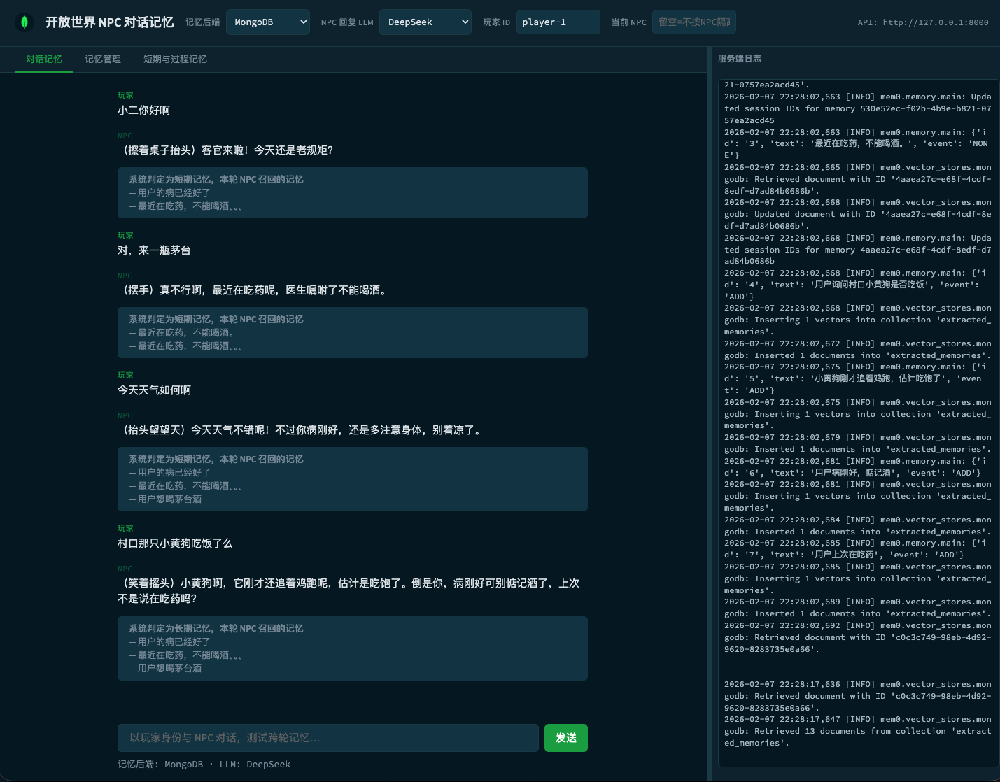

<div align="center">

# 🎮 开放世界 NPC 对话记忆测试

基于 **[mem0](https://github.com/mem0ai/mem0)** 的开放世界 NPC 对话记忆 Demo  
支持 **长期 / 短期 / 过程记忆**，向量存储使用 **MongoDB Atlas**



</div>

---

## 🌏 Language / 语言

- 中文（ZH）：继续往下阅读
- English (EN): jump to [English](#english-en)

## ✨ 功能概览

| Tab                | 功能                                                                                            |
| ------------------ | ----------------------------------------------------------------------------------------------- |
| **对话记忆**       | 玩家与 NPC 对话 → 自动召回记忆 → 生成回复 → LLM 判定长期/短期并写入；备注展示判定结果与召回内容 |
| **记忆管理**       | 按关键词搜索 · 按玩家 ID 获取/删除记忆                                                          |
| **短期与过程记忆** | 按会话（session_id）/ 按过期时间 / 过程记忆（步骤流程）三种方式添加                             |

> 右侧日志面板（SSE 实时推送）在所有 Tab 中共用。

**详细业务流程与架构图（Mermaid）见：** [docs/业务说明与流程.md](docs/业务说明与流程.md)

---

## 🧠 记忆类型说明

| 类型                 | 区分方式                           | 适用场景                     | 存储 / 检索                              |
| :------------------- | :--------------------------------- | :--------------------------- | :--------------------------------------- |
| **长期记忆**         | `user_id`，不设过期                | 用户偏好、账户信息、重要事实 | 永久保存，按 `user_id` + `agent_id` 检索 |
| **短期记忆（会话）** | `session_id`（mem0 内部 `run_id`） | 当前会话上下文、多步任务     | 会话结束可清空，对话时一并检索           |
| **短期记忆（过期）** | `expiration_date`（如 7 天后）     | 临时提醒                     | 过期后不再被检索                         |
| **过程记忆**         | `memory_type=procedural_memory`    | 步骤、流程、操作说明         | 按「怎么做」召回                         |

### 写入规则

对话时由 LLM 根据本轮内容判定为「**长期类**」或「**短期类**」：

- **长期类**（用户偏好、账户信息、重要事实）→ 始终按长期记忆写入，不带 `session_id`
- **短期类**（上下文、多步任务、临时提醒）→ 请求带 `session_id`，按短期会话记忆写入（传 `run_id=session_id`）

---

## 🏗️ 技术栈

| 层     | 技术                                                  |
| ------ | ----------------------------------------------------- |
| 后端   | FastAPI · mem0（OSS） · Voyage 嵌入 · DeepSeek        |
| 向量库 | MongoDB Atlas                                         |
| 前端   | 单页 HTML + 原生 JS · 左侧内容区 + 右侧可拖拽日志面板 |

---

## 📁 目录结构

```
mem0_memory_gaming_app/
├── backend/
│   ├── config.py              # 环境变量与配置
│   ├── db_init.py             # 启动时创建库/表/索引（存在则跳过）
│   ├── memory_backends.py     # mem0 后端配置（MongoDB）
│   ├── mongodb_search.py      # Atlas 向量/全文/混合检索 + Voyage rerank
│   ├── npc_personas.py        # 固定场景 NPC 人设与系统提示
│   ├── custom_categories.py   # 记忆元数据维度定义与 LLM 抽取
│   ├── main.py                # 对话、记忆管理、日志流等 API
│   ├── requirements.txt
│   ├── run.sh                 # 推荐启动方式
│   ├── data_preparation.ipynb # Wiki 数据清洗与导入 MongoDB
│   └── wiki_data_ingestion.ipynb
├── frontend/
│   └── index.html             # 三 Tab 界面 + 日志面板
├── docs/
│   └── 业务说明与流程.md       # 业务流程与架构图
├── wiki-data/
│   └── gaming_wiki_data.json  # 游戏百科数据
└── README.md
```

---

## ⚙️ 环境变量

在仓库根目录放置 `.env`（后端会优先读取仓库根目录的 `.env`），参考 `../.env.sample`：

| 变量               | 必填 | 说明                                |
| ------------------ | :--: | ----------------------------------- |
| `MONGODB_URI`      |  ✅  | MongoDB 连接串                      |
| `VOYAGE_API_KEY`   |  ✅  | Voyage 嵌入（mem0 用）              |
| `DEEPSEEK_API_KEY` |  ✅  | DeepSeek（NPC 回复 + 长短记忆分类） |
| `DEEPSEEK_MODEL`   |      | 可选，默认 `deepseek-chat`          |

---

## 🚀 本地运行

### 1. 后端（必须）

**推荐**（使用 `run.sh`）：

```bash
cd mem0_memory_gaming_app/backend
./run.sh
```

**手动启动**：

```bash
cd mem0_memory_gaming_app/backend
python -m venv .venv && source .venv/bin/activate
pip install -r requirements.txt
export PYTHONPATH=$(pwd)
uvicorn main:app --reload --host 0.0.0.0 --port 8000
```

> API 文档：`http://127.0.0.1:8000/docs`

### 2. 前端

```bash
cd mem0_memory_gaming_app/frontend
python -m http.server 5500
```

浏览器打开 `http://127.0.0.1:5500`，默认请求 `http://127.0.0.1:8000` 作为 API。

---

## 📖 使用说明

### 页头控制栏

| 控件     | 说明                                                       |
| -------- | ---------------------------------------------------------- |
| 玩家 ID  | 同一 ID 下记忆共用，默认 `player-1`                        |
| 当前 NPC | 填写则按「玩家 + NPC」隔离记忆；留空使用默认 `npc-default` |

### Tab 1 · 对话记忆

- 输入消息 → 后端召回**长期 + 当前会话短期**记忆 → 生成 NPC 回复 → 判定本轮为长期/短期并写入
- 每条回复下方展示：  
  `系统判定为 短期/长期 记忆，本轮 NPC 召回的记忆`

### Tab 2 · 记忆管理

- **搜索记忆**：关键词 + 条数，按当前玩家 / NPC 搜索
- **按玩家 ID 获取**：可选 NPC、条数，列出该范围记忆
- **按玩家 ID 删除**：清空该玩家（及可选 NPC）下全部记忆

### Tab 3 · 短期与过程记忆

| 功能               | 操作                                                       |
| ------------------ | ---------------------------------------------------------- |
| 短期（按会话）     | 输入内容 + 会话 ID（留空用当前页会话）→ 添加 / 获取 / 清空 |
| 短期（按过期时间） | 输入内容 + 过期天数（如 7）→ 添加，N 天后自动失效          |
| 过程记忆           | 输入步骤流程文本 → 添加，类型为 `procedural_memory`        |

> 添加时均带上当前玩家 ID 与 `agent_id`（与对话默认一致），保证对话能召回。

---

## 📡 API 一览

|   方法   | 路径                  | 说明                                                              |
| :------: | --------------------- | ----------------------------------------------------------------- |
|  `POST`  | `/chat`               | 对话：召回记忆 → 生成回复 → 判定长短记忆并写入                    |
|  `GET`   | `/health`             | 健康检查                                                          |
|  `GET`   | `/logs/stream`        | SSE 服务端日志流                                                  |
|  `POST`  | `/memory/search`      | 语义搜索记忆                                                      |
|  `POST`  | `/memory/add`         | 添加记忆（支持 `session_id` / `expiration_days` / `memory_type`） |
|  `GET`   | `/memory/by-user`     | 按玩家 ID 列出记忆                                                |
|  `GET`   | `/memory/by-session`  | 按会话列出短期记忆                                                |
|  `GET`   | `/memory/{memory_id}` | 按 ID 获取单条                                                    |
| `PATCH`  | `/memory/{memory_id}` | 按 ID 更新内容                                                    |
| `DELETE` | `/memory/{memory_id}` | 按 ID 删除单条                                                    |
| `DELETE` | `/memory`             | 按范围删除（`user_id` / `agent_id` / `session_id`）               |

> 完整参数见 `http://127.0.0.1:8000/docs`

---

## 🗄️ 库表与索引

| 后端        | 自动初始化                                                                                   |
| ----------- | -------------------------------------------------------------------------------------------- |
| **MongoDB** | 数据库 `mem0_agent_memory` → 集合 `extracted_memories` → 向量搜索索引（新索引约 1 分钟就绪） |

---

## 📦 依赖

```
mem0ai  ·  langchain-voyageai  ·  pymongo
fastapi  ·  uvicorn  ·  openai  ·  python-dotenv
```

详见 `backend/requirements.txt`。

---

## English (EN)

Open-world NPC conversation memory demo built on **[mem0](https://github.com/mem0ai/mem0)**.  
Supports **long-term / short-term / procedural memory**, with vector storage on **MongoDB Atlas**.

### Features

| Tab                         | What it does                                                                                                                                             |
| --------------------------- | -------------------------------------------------------------------------------------------------------------------------------------------------------- |
| **Chat memory**             | Chat with NPC → retrieve memory → generate reply → LLM classifies long/short memory and writes it back; UI shows the classification + retrieved memories |
| **Memory admin**            | Search memories · List/Delete memories by player id                                                                                                      |
| **Short-term & procedural** | Add memories by `session_id`, by expiration date, or as `procedural_memory`                                                                              |

### Memory types (quick reference)

- **Long-term**: keyed by `user_id`, no expiration (preferences / important facts)
- **Short-term (session)**: keyed by `session_id` (mem0 `run_id`), for session context / multi-step tasks
- **Short-term (expiration)**: has `expiration_date`, stops being retrieved after expiry
- **Procedural**: `memory_type=procedural_memory`, used for “how-to” steps

### Tech stack

- **Backend**: FastAPI, mem0 (OSS), Voyage embeddings, DeepSeek
- **Vector store**: MongoDB Atlas
- **Frontend**: single-page HTML + vanilla JS (with a shared SSE log panel)

### Environment variables

Put `.env` at the **repo root** (the backend loads root `.env` first). Use `../.env.sample` as a starting point.

Required:

- `VOYAGE_API_KEY`
- `DEEPSEEK_API_KEY`
- `MONGODB_URI`

### Run locally

Backend:

```bash
cd mem0_memory_gaming_app/backend
./run.sh
```

Frontend:

```bash
cd mem0_memory_gaming_app/frontend
python -m http.server 5500
```

Open:

- Frontend: `http://127.0.0.1:5500`
- API docs: `http://127.0.0.1:8000/docs`
