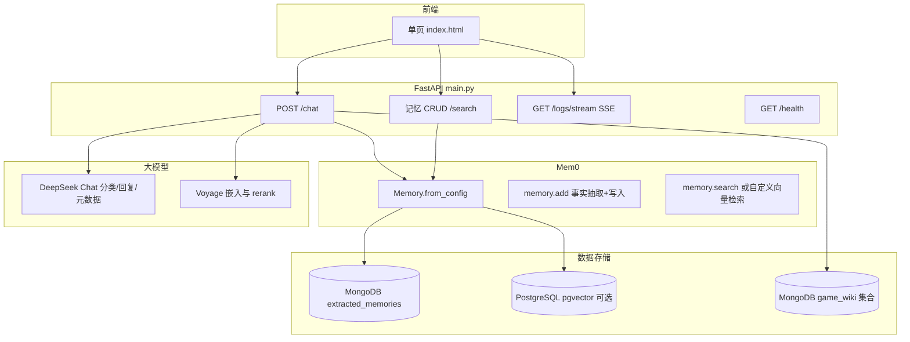
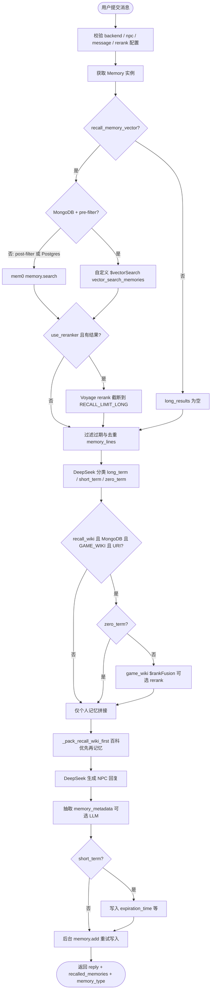
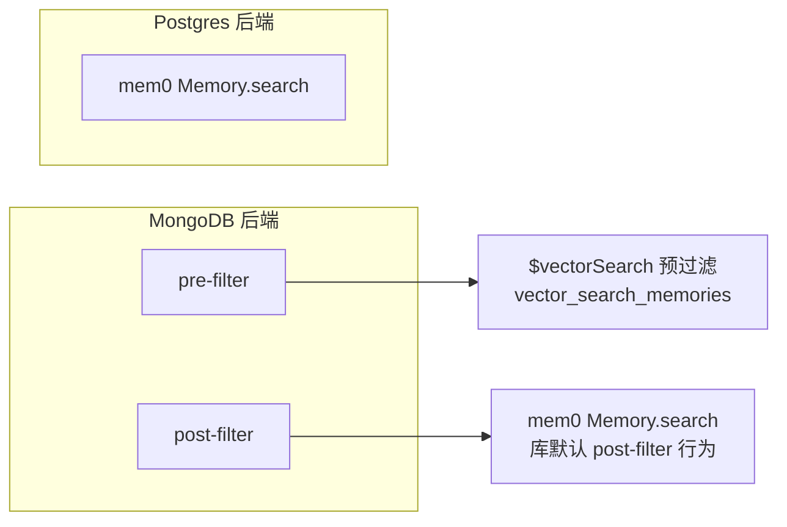
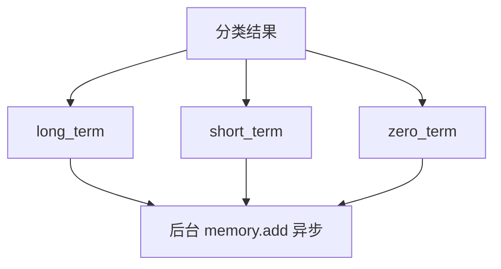
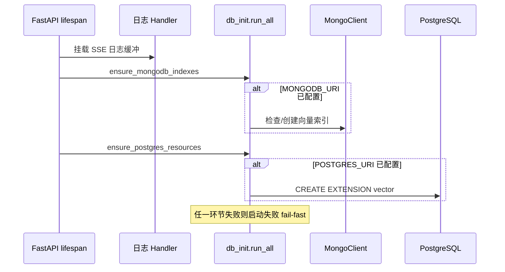

# Mem0 游戏 NPC 对话记忆 Demo — 业务说明与流程

本文档描述 `mem0_memory_gaming_app` 的业务目标、系统组成、**整体业务流程**以及核心接口与数据流，便于产品、开发与运维对齐。

---

## 1. 项目定位

本应用是一个 **NPC 对话 + 长期记忆** 的演示系统：

- **玩家**与 **NPC** 通过前端页面聊天；后端使用 **DeepSeek**（OpenAI 兼容 API）生成 NPC 回复。
- **记忆层**使用 **Mem0**，向量存储支持 **MongoDB Atlas**（`extracted_memories`）或 **PostgreSQL + pgvector**。
- 可选 **game_wiki** 百科库：在 MongoDB 上对独立集合做 **向量 + 全文** 混合检索（`$vectorSearch` + `$search` + `$rankFusion`），将片段拼入上下文。
- 可选 **Voyage** 对记忆与百科候选做 **rerank**；嵌入与 Mem0 侧一致使用 Voyage。

---

## 2. 系统架构（逻辑视图）

---

## 3. 整体业务流程图（核心：一次对话请求）

从用户发送到收到回复，主路径为 **`POST /chat`**，顺序如下。

**要点说明：**

| 阶段         | 行为                                                                                                 |
| ------------ | ---------------------------------------------------------------------------------------------------- |
| 向量记忆召回 | MongoDB **pre-filter** 走自定义 `$vectorSearch`；**post-filter** 与 Postgres 走 Mem0 原生 `search`。 |
| Rerank       | 需配置 `VOYAGE_API_KEY`；失败时接口返回 **502**（不再静默丢弃结果）。                                |
| 百科         | `zero_term` 时**跳过** wiki，减少无意义检索。                                                        |
| 回复         | 必须配置 `DEEPSEEK_API_KEY`，否则 **503**。                                                          |
| 写入         | `memory.add` 在 **BackgroundTasks** 中异步执行；失败会抛出异常（由框架记录），不再「仅打日志跳过」。 |

---

## 4. 记忆检索模式（`memory_vector_filter_mode`）

- **pre-filter**：过滤条件在 Atlas **向量索引阶段**生效，与 Mem0 默认行为不同，适合严格按 `user_id` / `agent_id` 裁剪。
- **post-filter**：与 Mem0 文档一致，由库在召回后再过滤。

---

## 5. game_wiki 百科混合检索（MongoDB）

当 `GAME_WIKI_ENABLED`、配置了 `MONGODB_URI`、且请求开启 `recall_wiki_hybrid` 时：

1. 在 **同一 game_wiki 集合**上，向量索引与全文索引均需 **READY**。
2. 使用 **`hybrid_search_game_wiki`**：`$rankFusion` 融合 `$vectorSearch`（autoEmbed）与 `$search`（BM25 等）。
3. 可选 **Voyage rerank** 融合后的候选。
4. 文档转为 `[Wiki] ...` 文本片段，与「个人记忆」合并时 **wiki 优先**，并受 `GAME_WIKI_RECALL_LIMIT`、`RECALL_MAX_*` 等约束。

检索或索引异常时抛出 **`GameWikiSearchError`** / **`VoyageRerankError`**，由 `/chat` 转为 **502**（不再回退为「仅向量」或空结果）。

---

## 6. 记忆类型与写入字段

**说明：** `zero_term` 仅用于 **跳过百科检索** 与展示「本轮判定」；当前实现仍会异步执行 `memory.add`，由 Mem0 + LLM 事实抽取决定是否产生可写入条目。

- **long_term / short_term / zero_term** 由 DeepSeek 根据本轮用户句分类（无 Key 时当前实现为默认 **long_term** 且不调用分类 API，具体以代码为准）。
- **short_term** 会在 `metadata` 中写入 **`expiration_time`**（UTC），供短期记忆过期过滤。
- **memory_metadata**：多维度 0～1 分数（如 `task_priority`、`emotion`），由 LLM 抽取；未配置 Key 时返回中性量表，配置后失败则 **502**。

---

## 7. 应用启动与数据库初始化

- `MONGODB_URI` / `POSTGRES_URI` **为空**时跳过对应初始化，**不视为错误**。
- 初始化 **失败会直接抛出**，应用 **不启动**（便于尽早发现连接或权限问题）。

---

## 8. 主要 HTTP API 一览

| 方法   | 路径                 | 用途                                        |
| ------ | -------------------- | ------------------------------------------- |
| POST   | `/chat`              | 主对话：召回 + 百科 + NPC 回复 + 异步写记忆 |
| GET    | `/health`            | 健康检查                                    |
| GET    | `/npcs`              | NPC 列表                                    |
| POST   | `/memory/search`     | 记忆语义搜索                                |
| GET    | `/memory/{id}`       | 单条记忆                                    |
| PATCH  | `/memory/{id}`       | 更新记忆                                    |
| DELETE | `/memory/{id}`       | 删除记忆                                    |
| DELETE | `/memory`            | 按范围批量删除                              |
| POST   | `/memory/add`        | 手动添加记忆                                |
| GET    | `/memory/by-session` | 按会话 run_id 取记忆                        |
| GET    | `/memory/by-user`    | 按用户取记忆                                |
| GET    | `/logs/stream`       | SSE 服务端日志流                            |

---

## 9. 关键环境变量（节选）

| 变量                                  | 作用                                 |
| ------------------------------------- | ------------------------------------ |
| `MONGODB_URI`                         | Mem0 Mongo 存储 + game_wiki 连接     |
| `POSTGRES_URI`                        | 可选 Postgres 后端                   |
| `DEEPSEEK_API_KEY` / `DEEPSEEK_MODEL` | NPC 回复、分类、memory_metadata      |
| `VOYAGE_API_KEY`                      | 嵌入与 rerank                        |
| `GAME_WIKI_*`                         | 百科库名、集合名、索引名、召回条数等 |
| `GAME_WIKI_ENABLED`                   | 是否启用百科逻辑                     |

详细默认值见 [`backend/config.py`](../backend/config.py)。

---

## 10. 前端与日志

- 前端为静态 [`frontend/index.html`](../frontend/index.html)，通过 `fetch` 调用上述 API。
- 服务端日志经 **`LogBufferHandler`** 写入内存队列，**GET `/logs/stream`** 以 SSE 推送到页面，便于调试 Mem0 与检索。

---

## 11. 相关源码索引

| 模块       | 路径                           | 说明                                          |
| ---------- | ------------------------------ | --------------------------------------------- |
| 入口与路由 | `backend/main.py`              | `/chat`、记忆 API、SSE                        |
| 检索与百科 | `backend/mongodb_search.py`    | `$vectorSearch`、`$rankFusion`、Voyage rerank |
| Mem0 配置  | `backend/memory_backends.py`   | Mongo / Postgres 与嵌入、LLM                  |
| 分类维度   | `backend/custom_categories.py` | `memory_metadata` 槽位                        |
| 启动建索引 | `backend/db_init.py`           | Mongo 向量索引、pgvector 扩展                 |
| NPC 人设   | `backend/npc_personas.py`      | 系统提示与 ID 校验                            |

---

## 12. 文档版本说明

- 流程与接口以仓库内 **当前代码** 为准；若你升级 Mem0、Atlas 或 FastAPI 行为，请同步更新本节与图示。
- Mermaid 图可在支持 Mermaid 的 Markdown 预览（如 VS Code、GitHub）中直接渲染。
