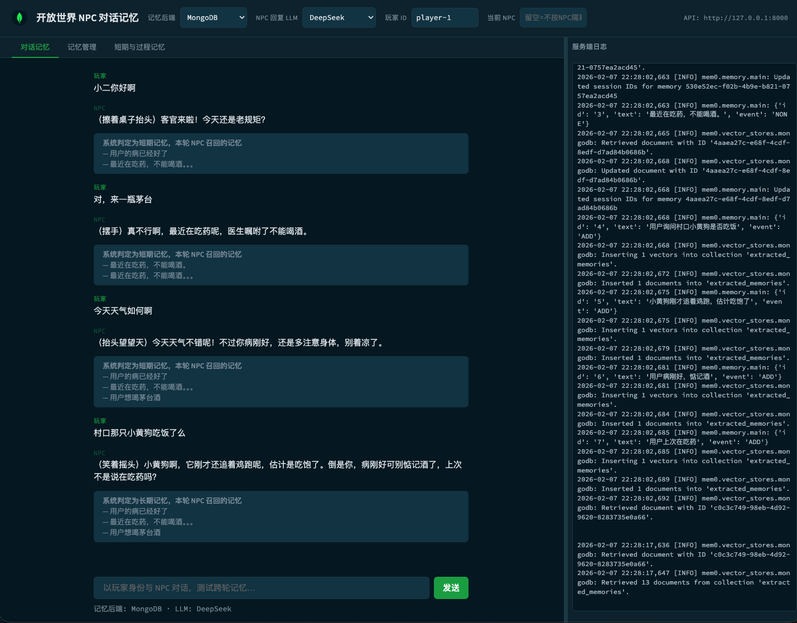

<div align="center">

# 🎮 开放世界 NPC 对话记忆测试

基于 **[mem0](https://github.com/mem0ai/mem0)** 的开放世界 NPC 对话记忆 Demo  
支持 **长期 / 短期 / 过程记忆**，可切换 **MongoDB** 或 **PostgreSQL（pgvector）** 对比存储与召回表现



</div>

---

## ✨ 功能概览

| Tab | 功能 |
|-----|------|
| **对话记忆** | 玩家与 NPC 对话 → 自动召回记忆 → 生成回复 → LLM 判定长期/短期并写入；备注展示判定结果与召回内容 |
| **记忆管理** | 按关键词搜索 · 按玩家 ID 获取/删除记忆 |
| **短期与过程记忆** | 按会话（session_id）/ 按过期时间 / 过程记忆（步骤流程）三种方式添加 |

> 右侧日志面板（SSE 实时推送）在所有 Tab 中共用。

---

## 🧠 记忆类型说明

| 类型 | 区分方式 | 适用场景 | 存储 / 检索 |
|:-----|:---------|:---------|:------------|
| **长期记忆** | `user_id`，不设过期 | 用户偏好、账户信息、重要事实 | 永久保存，按 `user_id` + `agent_id` 检索 |
| **短期记忆（会话）** | `session_id`（mem0 内部 `run_id`） | 当前会话上下文、多步任务 | 会话结束可清空，对话时一并检索 |
| **短期记忆（过期）** | `expiration_date`（如 7 天后） | 临时提醒 | 过期后不再被检索 |
| **过程记忆** | `memory_type=procedural_memory` | 步骤、流程、操作说明 | 按「怎么做」召回 |

### 写入规则

对话时由 LLM 根据本轮内容判定为「**长期类**」或「**短期类**」：

- **长期类**（用户偏好、账户信息、重要事实）→ 始终按长期记忆写入，不带 `session_id`
- **短期类**（上下文、多步任务、临时提醒）→ 请求带 `session_id`，按短期会话记忆写入（传 `run_id=session_id`）

---

## 🏗️ 技术栈

| 层 | 技术 |
|----|------|
| 后端 | FastAPI · mem0（OSS） · Voyage 嵌入 · DeepSeek / Azure OpenAI |
| 向量库 | MongoDB Atlas 或 PostgreSQL（pgvector） |
| 前端 | 单页 HTML + 原生 JS · 左侧内容区 + 右侧可拖拽日志面板 |

---

## 📁 目录结构

```
mem0_memory_test_app/
├── backend/
│   ├── config.py              # 环境变量与配置
│   ├── db_init.py             # 启动时创建库/表/索引（存在则跳过）
│   ├── memory_backends.py     # mem0 双后端封装（MongoDB / PostgreSQL）
│   ├── main.py                # 对话、记忆管理、日志流等 API
│   ├── requirements.txt
│   ├── run.sh                 # 推荐启动方式
│   └── .env.example           # 环境变量示例
├── frontend/
│   └── index.html             # 三 Tab 界面 + 日志面板
└── README.md
```

---

## ⚙️ 环境变量

在项目根目录或 `backend/` 下放置 `.env`，参考 `backend/.env.example`：

| 变量 | 必填 | 说明 |
|------|:----:|------|
| `MONGODB_URI` | △ | MongoDB 连接串（至少配一个向量库） |
| `POSTGRES_URI` | △ | PostgreSQL 连接串 |
| `VOYAGE_API_KEY` | ✅ | Voyage 嵌入（mem0 用） |
| `DEEPSEEK_API_KEY` | ✅ | DeepSeek（NPC 回复 + 长短记忆分类） |
| `DEEPSEEK_MODEL` | | 可选，默认 `deepseek-chat` |
| `AZURE_OPENAI_ENDPOINT` | | 可选，用 Azure 做 NPC 回复时必填 |
| `OPENAI_API_KEY` | | 可选，Azure 时必填 |
| `AZURE_DEPLOYMENT` | | 可选，默认 `gpt-4o` |
| `AZURE_API_VERSION` | | 可选，默认 `2024-02-15-preview` |

> △ 表示至少配置一个向量库即可。

---

## 🚀 本地运行

### 1. 后端（必须）

**推荐**（使用 `run.sh`）：

```bash
cd mem0_memory_test_app/backend
./run.sh
```

**手动启动**：

```bash
cd mem0_memory_test_app/backend
python -m venv .venv && source .venv/bin/activate
pip install -r requirements.txt
export PYTHONPATH=$(pwd)
uvicorn main:app --reload --host 0.0.0.0 --port 8000
```

> API 文档：<http://127.0.0.1:8000/docs>

### 2. 前端

```bash
cd mem0_memory_test_app/frontend
python -m http.server 5500
```

浏览器打开 <http://127.0.0.1:5500>，默认请求 `http://127.0.0.1:8000` 作为 API。

---

## 📖 使用说明

### 页头控制栏

| 控件 | 说明 |
|------|------|
| 记忆后端 | MongoDB / PostgreSQL 切换 |
| NPC 回复 LLM | DeepSeek / Azure OpenAI |
| 玩家 ID | 同一 ID 下记忆共用，默认 `player-1` |
| 当前 NPC | 填写则按「玩家 + NPC」隔离记忆；留空使用默认 `npc-default` |

### Tab 1 · 对话记忆

- 输入消息 → 后端召回**长期 + 当前会话短期**记忆 → 生成 NPC 回复 → 判定本轮为长期/短期并写入
- 每条回复下方展示：  
  `系统判定为 短期/长期 记忆，本轮 NPC 召回的记忆`

### Tab 2 · 记忆管理

- **搜索记忆**：关键词 + 条数，按当前玩家 / NPC 搜索
- **按玩家 ID 获取**：可选 NPC、条数，列出该范围记忆
- **按玩家 ID 删除**：清空该玩家（及可选 NPC）下全部记忆

### Tab 3 · 短期与过程记忆

| 功能 | 操作 |
|------|------|
| 短期（按会话） | 输入内容 + 会话 ID（留空用当前页会话）→ 添加 / 获取 / 清空 |
| 短期（按过期时间） | 输入内容 + 过期天数（如 7）→ 添加，N 天后自动失效 |
| 过程记忆 | 输入步骤流程文本 → 添加，类型为 `procedural_memory` |

> 添加时均带上当前玩家 ID 与 `agent_id`（与对话默认一致），保证对话能召回。

---

## 📡 API 一览

| 方法 | 路径 | 说明 |
|:----:|------|------|
| `POST` | `/chat` | 对话：召回记忆 → 生成回复 → 判定长短记忆并写入 |
| `GET` | `/health` | 健康检查 |
| `GET` | `/logs/stream` | SSE 服务端日志流 |
| `POST` | `/memory/search` | 语义搜索记忆 |
| `POST` | `/memory/add` | 添加记忆（支持 `session_id` / `expiration_days` / `memory_type`） |
| `GET` | `/memory/by-user` | 按玩家 ID 列出记忆 |
| `GET` | `/memory/by-session` | 按会话列出短期记忆 |
| `GET` | `/memory/{memory_id}` | 按 ID 获取单条 |
| `PATCH` | `/memory/{memory_id}` | 按 ID 更新内容 |
| `DELETE` | `/memory/{memory_id}` | 按 ID 删除单条 |
| `DELETE` | `/memory` | 按范围删除（`user_id` / `agent_id` / `session_id`） |

> 完整参数见 <http://127.0.0.1:8000/docs>

---

## 🗄️ 库表与索引

| 后端 | 自动初始化 |
|------|------------|
| **MongoDB** | 数据库 `mem0_agent_memory` → 集合 `extracted_memories` → 向量搜索索引（新索引约 1 分钟就绪） |
| **PostgreSQL** | `CREATE EXTENSION IF NOT EXISTS vector;`，mem0 首次写入时自动建表 |

> 若只测一种后端，仅配置对应 URI 即可。

---

## 📦 依赖

```
mem0ai  ·  langchain-voyageai  ·  pymongo  ·  pgvector  ·  psycopg2-binary
fastapi  ·  uvicorn  ·  openai  ·  python-dotenv
```

详见 `backend/requirements.txt`。
